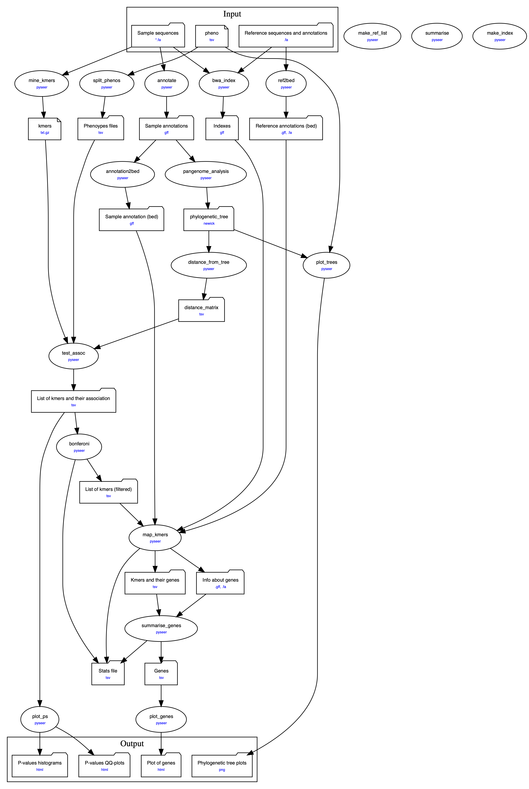
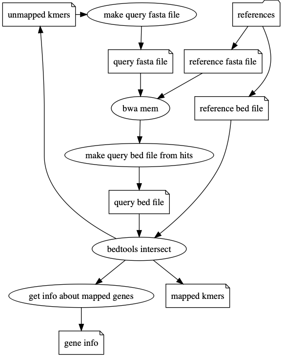
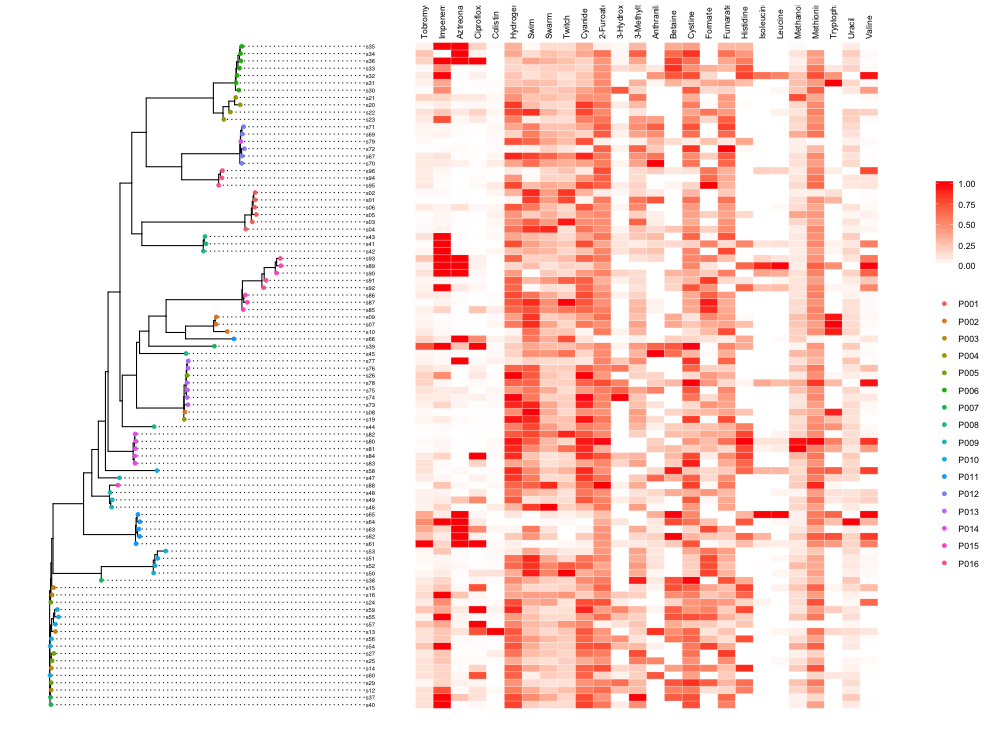
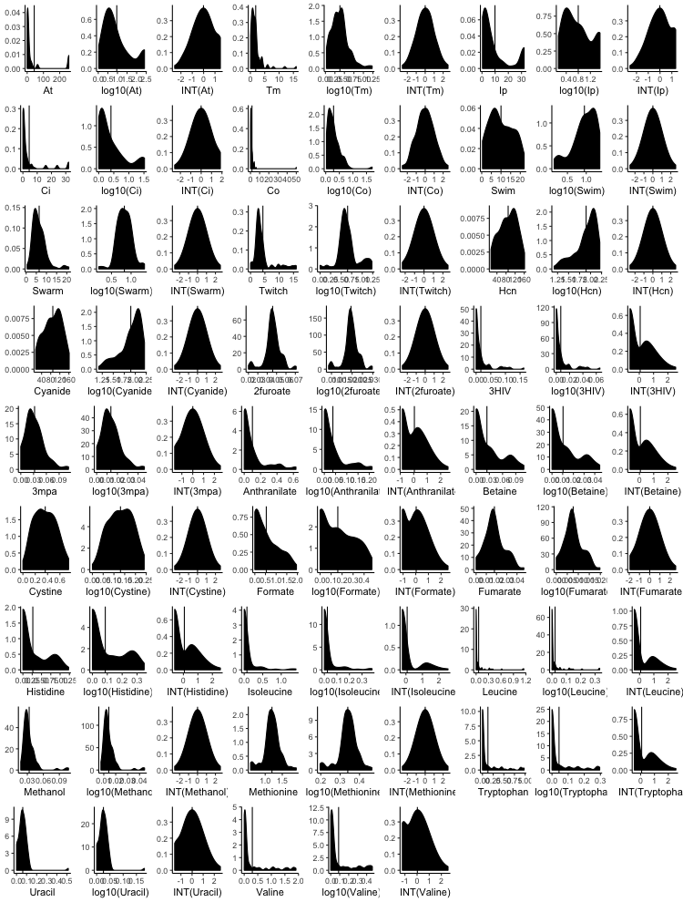
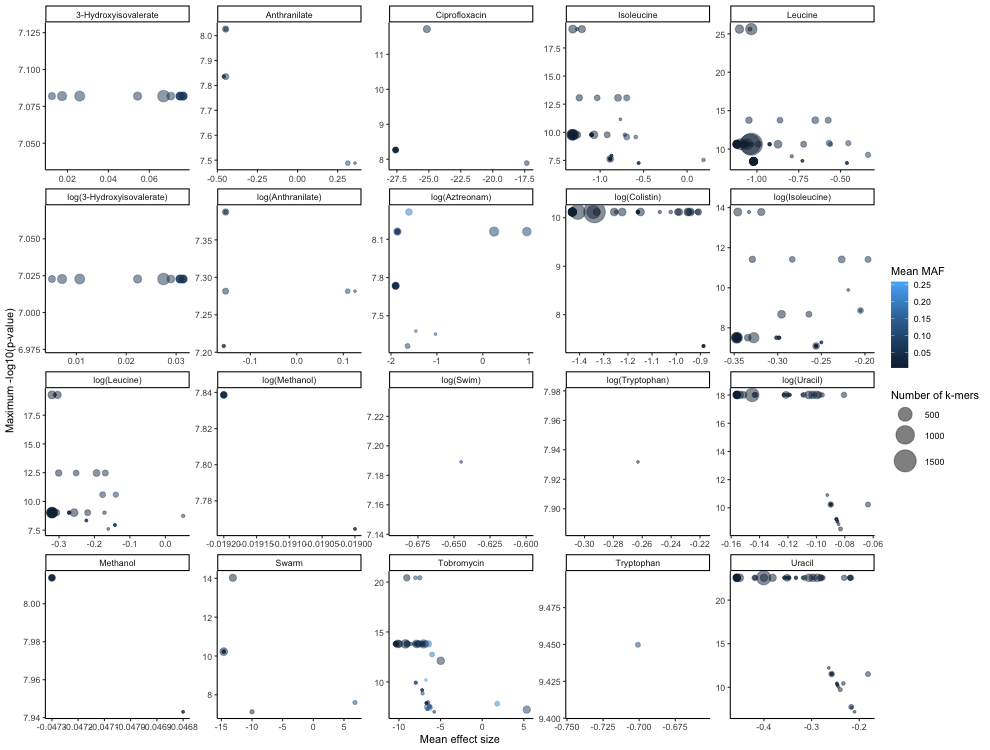

```{r setup, include=FALSE}
library(dplyr);
library(tidyr);
library(ggplot2);
library(knitr);
knitr::opts_chunk$set(echo=FALSE, message=FALSE, warning=FALSE);
source("tables.R");
```

# Abstract

Genome-wide association studies (GWAS) are now applied more often to bacterial populations.

Specificially, a new method which is alignment free is being deployed.

Thestudies based on mixed width K-mers as apposed to short nucleotide polymorphisms are being deployed, and packages such as *pyseer* are making it possible.
However, there is not at present a succint tool which pipelines the necessary intermediry data processing and analysis steps.
Let alone combines all these tests and allows for multiple association studies to be peformed at once, and distrubuted onto multiple nodes in a computer cluster.

which has utility in a time metabolomics data is becoming more common, and so the need to determine the genetic bases of possible hundreds of phenotypes as once is a requreid.

I researched, developed, and wrote and installable pipeline tool, *bgwas* which can test the association of multiple phenotypes at once to genetic loci.
The tool integrates various open source software tools for Kmer counting, gene annotation, phylogeny estimation, kmer association testing, kmer-gene mapping and finally visualisation.

In creating the tool, best practices for computational biology where excercised; resulting in a final tool that expresses approprate testing, documentation and packaging; meaning it can easily be utilised by other in the future.

The tool was also used to test the assocation of n phenotypes - some relatiing to antibiotic resistance and others metabolomics measures - and the outputs suggest the tool is usuable, but similary provides insights into future improvements that could be made

# Acknowledgements

# Abreviations

# Introduction
## Pangenome wide association studies

There is a recent wealth of becterial genomes and phenotype data, and the repositories are rapidly expanding.


In conjunction, there are increasingly more studies whose focus is on identifying the genetic basis of traits. (TODO ref)
In bacteria, these traits may corrsepond with virulence, resisitance, or some other quality that improves their ability as effecitve pathaogens, and for this reason,
discovering the genetic resoning could lead to identigying targets for pharmaceutical intervention, and my ncrease the efficac of treatment

Some studies have taken the approach of finding specifi clonal groups as apposed to genetic loci. (ref)
Genome wide association studies can be used to identify genetetic and phenotype assocations in a hypthoses free manner.

They have been used successfully in multiple human based studies.

Commonly, the units of variation that have been tested for assocation have been single nucleotide polymorphisms (SNPS).

SNPS have many advantages in organsims where recombination is reliable and genomes remain relatively consistant among populations.

Because of linkage disequilibrium, identigying a highly associated SNP often means that the true associated loci is nearby

However, the nature of bacteria replication makes the use of SNPs in association studies less useful.

For one, significat regions of the geneome can be in linkage disequilibrium:And though some species experience high rates of recombination, the recombination is not as reliable or consistent as that in, say, humans to reduce LD.

Secondly, bacteria experince much higher trans? during recombination. 
Therfore, bacteria of the same species? can vary consideriably in both order of gene content, and in the accessory genome - regions of the geneome which differ.

Therfore, first finding SNPs becomes a tricky process which involves multiple alignments. Such tools such as mummer (and other?) do meet this problem, but even still, SNPs assocated with ony the core genome can be retrieved
and does not consider the huge variable accessory genome in bacteria/ will not encapsulate the ful0

As an alternative, some recent studies have instead utlised K-mers.

Kmers are simply variable length sequences of DNA
Initially a concept of genome assembly
Can caputre multiple geneetic variations 
SNPs, 
longer deletions/ insertions 
and recombination 
The size of kmers effects the genetic variation captured
Longer more specificS
Shorter are more sensitive

Getting kmers is alignment freee, releasignt he burden of ultie alighnemt
But more specifically utilisng kmers means the core ans accesory geneome can be tested.

Seer (se (ref) and its reimplementation (pyseer) 
dbgwas


## The Need for Multiple Assocation Tests - Metabolomics

Metabolomics provides a detailed snapshot of an organism’s physiological state through the quantification of hundreds to thousands of small molecules (Zampieri et al., 2017). 

Coupling genomics and metabolomics to study Pseudomonas aeruginosa in unique clinical samples can allow us to understand how bacteria adapt to the lung environment.

The nature of metabolimics measn that multiple molecules abundance may be measured and of interest to investigate.

Determint the genetic basis of metabolomics of P ing the context of chronic invextions


## Scope of work

The foundation of this project was to create a tool, *bgwas3*,
an integration of mutltiple open source genomics tools 
and custom scripts written in python, R and bash
into a single installable package 
that facilitates conducting multiple pangenome wide association studies
in a single user step.

The tool aims to be comprehensive and robust enough to convert only the most basic required input files 
into valuable and interpretable results 
including static and interactive visualisations.

When run on a node within a computer cluster, 
tasks that are computationaly intensive or long 
are distrubuted among the cluster,
and can run simultaneuously.

Though the additional confugiureation file, the specifics of multile intermiedary steps can be altered, which can have variable effects on the final results.

In light of the necessity to peform multpple.. (\ref{fig:pipe})

# Methods

```{r out.height="90%", fig.align="center", fig.cap="\\label{fig:pipe}Pipeline of bgwas"}
;
```

## CGATcore

*bgwas3* was written primarily in python, utilising the piplining framework CGATCore, [@cribbs_cgat-core:_2019], an update to CGATRuffus (ref). 

The framework comes as a dependency free Python package.

The ethos behind the framework is to wrape pipeplining steps into disperate Python functions. Through the use of python decoratiors, these functions (referrred to as tasks)  

The tool's usfulness of CGATcore is twofold. 

First, the tool can make use of/ incoprtate a yml configuration file

The tool determines the dependency of tasks, and compeltes them in order.

It checks for what tasks need to be run by files last modification date.Therefore if files are removed or added, only tasks that are out of date are re run.

Allows independent tasks to be run in parralel.

The recent addition (CGATCore) was written so as to take advantage of the benefitis that computer clusters provide. 

It workd alongside a Distrubuted Resourse Management Appilication API (DRMAA) such as PBS-pri/Torque (used by imperial)

In its current iteration, *bgwas3* is comprised of n 'tasks', as visualised in figure. Starting with just three file types.

## Genome Annotation

In the *bgwas* task "annotatate" all sample sequences are annotated by Prokka [@seemann_prokka:_2014]
The tool functions as follows:
It first makes predictions on features using a number of external tools including Prodigal [@] for the anotation of coding region, RNAmmer for ribosomal RNA genes, Aragorn for transfer RNA genes, SignalP for signal leader peptides and Infernal for non-coding RNA.
After feature prediction, the speculative features are queryed against a umber of databes suchs as UniProt [@], Refseq [@] and Pfam.

The function of annotating input sequences in the *bgwas3* pipeline is twofold. 
First, gene annotations are later used to estimate the phylogenetic tree of the sample,
and secondly, significantly associated Kmers are later mapped to the annatated genomes when identifying the Kmer's genetic identity.

## Kmer minig and counting

*bgwas3* integrates the tool fsm-lite [@valimaki_fsm-lite_2018] to count 'mine' and count Kmers. of user defined variable length kmers in the all samples.
fsm-lite benefits first by being able to run on a single core, but also because of its ability to read and count Kmers not of a single length, but of a range of lengths, unlike similar tools such as DSK?
As mentioned before, the length of Kmers effects the specificuty and ? of the association testing.
Therefore *bgwas3* allows the Kmers length to be changed by editing the configuration yml file ?

## Phylogeny estimation and covariate estimation

*bgwas3* currently takes a pangenomic approach to phylogeny estimation; as in it consideres the relative prescence and absence of genes in the samples as 
An estimated phylogenetic tree is estimated with *bgwas3* primariy utilisng the tool Roary [@page_roary:_2015].
In summary, Roary determnes genes which fall within the coregeneome, and then peforms clustering of isolates are clustered based on gene presence in the accessory genome.
An newick tree output of roary, is then converted into a distance matrix using a pythons script from pyseer.

The single reasoning for prediciting phylogeny in the *bgwas3* pipeine is to use the distances defined in the distance matrix as covariates int the assocation testing.

This is different to the standard method of multi-dimensional scaling often used in human gwas and as part of the standard seer workflow.
In general, if a phylogeny is accurate, th


## Kmer association testing

For linear mixed model assocation testing, a bgwas3 constructs a distance matrix based on a phylogenetic tree.
Assocation between kmers and phenotypes is implemented with pyseer [@lees_pyseer:_2018].

Specificially, pyseer is used to peform a linear mixed model using the Fast-LMM algorithm [@lippert_fast_2011].

LMM tackle confounders in association tests by using a measure of similarity (in this case a distance defined from a estimated phylogenetic tree) as a random effect in a linear model.

TODO equation

Given a means of determining the hierarchichal relatedness between samples, the mixed model is generally preffered, and has been shown in past studies to control the inflation of p-values better [@lees_genome-wide_2017].

## Bonferoni correction

The output of pyseer, a list of all kmers and statistics relating to their association to the given phenotype, are then filtered by their p-value though bonferoni correction.
The Bonferroni correction is a multiple-comparison correction used when several dependent or independent statistical tests, utilised to limit the number of spurious positive tests.
f multiple hypotheses are tested, the chance of a rare event increases, and therefore, the likelihood of incorrectly rejecting a null hypothesis (i.e., making a Type I error) increases
An R script **bonf.R** calculates a threshold p-value of which to accept an assocated kmer as significant based on its p-value


## Significant Kmer mapping

```{r,, fig.cap="\\label{fig:make_kmers}Graphical representation of algorithm to map Kmers to reference genes"}
;
```

A new script, written in R **map_kmers.R**, and which calls on the external tools BWA-Mem [@] and Bedtools [@] attempts to assign each associated kmer to a gene found in either a supplied reference genome, or one of the sample geneomes which has previously been annotated.
The be
The script works as follows, and demonstrated in fig:make_kmers.

1. Generate a Multi-Fasta file whereby all Kmers are represented as a single fasta enter.
2. 

## Visualisation

An important feature of *bgwas3* is the automated generation of multiple figures, integrated into a final wbe based report.

## Scienitif computing practices

A significant goal of bgwas3 was to implement a useful and resuable tool that may be used outside the scope of this singlular project.

As such, various software development principles and concepts were applied to the project.

### Testing with PyTest and Travis

Pytest and 

### Documentation with Sphinx

### Packaging with Conda

# Results

For the development, testing, and evaluation of *bgwas3* a dataset of 

Cystic fibrosiis is a an autosomal recessive disorder that, due to a single gene mutation, limits the ings ability to 
Pseaudomonas euruginosa is one of the prmary bacteria present in the lungs of late stage and terminal patients with cystic fibrosis. ref(Schaedel et al., 2002; Hauser, 2011) (becomes chronic). when the lung begins to exhibit decreased function and signs of failure
For this reason, undesrstanding the genetic adaptations pseudomonas experience when in chrnic state is significantly important in talking this disease

This dataset involves n strains collected over a period of 24 years from 18 patients. ref

In paper () it was shown that there was 'clear evidence' of the metabolic lung environment surrounding the bacteria. Specifically acetate production was negatively associated with length of infection
and others? 

To test the usability and application of bgwas3, 

The strong LD caused by the clonal reproduction of bacterial populations means that non-causal k-mers may also appear to be associated.?

Confirmation of known resistance

```{r echo=FALSE, error=FALSE, message=FALSE, results='asis',  fig.cap="\\label{table:non-metabolites}Table of non-metabolite phenotypes"}
dat_non_met %>% knitr::kable();
```

```{r echo=FALSE, error=FALSE, message=FALSE, results='asis', fig.cap="\\label{table:metabolites}Table of metabolite phenotypes"}
dat_met %>% knitr::kable();
```

```{r, fig.cap="\\label{fig:cormat}Correlation matrix of phenotypes"}
source("plot_cormat.R");
plot_cormat;
```

```{r, out.height="90%", fig.align="center", fig.cap="\\label{fig:dens}Density plots"}
;
```

## Processing of phenotypes
```{r, out.height="90%", fig.align="center", fig.cap="\\label{fig:dens}Density plots"}
;
```

When assocation testing a qualitatitve variable with linear regression, it is generally assumed that the variable follows a normal distrubution.
Non-normal variables may fail to control for type-1 errors.

Quantitative (continuous) traits are preferred because they contain more information. 
the linear regression analysis requires all variables to be multivariate normal. 

A popular statistical technique to bring normality to a continuous trait in association studies involves peforming log transformation, or a rank based normal transformation. 

Prior to running *bgwas*, the n phenotypes were seperateley log transformed and INT, essesintially trippling the number of phenotypes tested.

## Annotation
All 91 geneomes where annotated and 14643 unique genes were identified using Prokka.

## Kmer mining
Number etc

## Association results

```{r, out.height="90%", fig.align="center", fig.cap="\\label{fig:genes}Gens"}
;
```

```{r echo=FALSE, error=FALSE, message=FALSE, results='asis', fig.cap="\\label{table:genes}Table of metabolite phenotypes"}
dat_genes %>% knitr::kable();
```


# Discussion

## Genome annotation

## Kmer mining

The tool fsm

Prokka is a good tool
?Settings
## Phylogeny prediction
Currently, *bgwas3* implements only a pangenomic approach approach of distance estimation.
There are other tools which involve alignment of the core genome and snps...
May or may not be bettter 
Reintroduce the problem of a large multiple alignment.


# References

