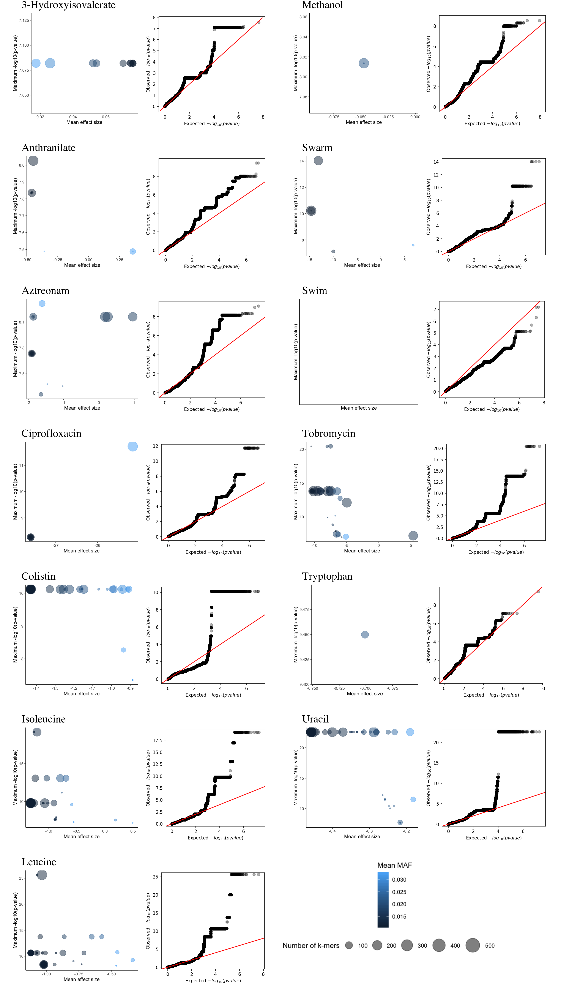

```{r setup, include=FALSE}
library(dplyr);
library(tidyr);
library(ggplot2);
library(knitr);
knitr::opts_chunk$set(echo=FALSE, message=FALSE, warning=FALSE);
source("tables.R");
```
\fancypagestyle{plain}{%
  \renewcommand{\headrulewidth}{0pt}%
  \fancyhf{}%
  \fancyhead[C]{\footnotesize \thepage}
  \setlength\footskip{0pt}
}
\pagestyle{plain}

# Abstract {-}

Genome-wide association studies (GWAS) are now being applied more often to microbes.
However, bacteria genomes are significantly more variable in both content and sequence than eukaryotic genomes,
meaning these association studies have naturally different, more complex considerations.
These studies utilise short unique DNA patterns, 
referred to as k-mers,
as units of genetic variation 
as opposed to single nucleotide polymorphisms.
Various software solutions are now available 
which can perform the multiple association tests of k-mers,
notable the python based *pyseer*.
However, there is not at present a succinct tool
which pipelines the necessary pre and post data processing and analysis steps
that make an association study whole,
such as associating the k-mers to genes.

In metabolomics,
thousands of possible measures that can be taken
corresponding to the level of molecules inside or around a cell.
These measures can be considered as traits of that bacteria at a that point in time.
Coupling genomics and metabolomics may provide a powerful technique to understanding how a bacteria has adapted,
and in the scope of disease,
may aid in the understanding of the function of drug resistance and other virulence features.
However conducting individual association tests for each metabolomic trait is time and computationally intensive.

I developed a tool, *bgwas3*,
which wraps the k-mer association function of *pyseer*
with other open source software tools
into a single installable package.
When run, *bgwas3* takes the simplest of input files
and a configuration file,
and performs gene annotation,
phylogeny estimation,
k-mer association testing,
and k-mer-to-gene mapping  
while also generating automatic visualisations and a web-based report.

The tool, found at https://github.com/g-r-eg/bgwas3, was built with best practices for scientific computing in mind, and is is installable as a conda package.

The tool was also used to test the association of 26 traits of *Pseudomonas auriginosa*;
18 relating corresponding to a metabolomic measurement,
and 8 corresponding to either a measure of to antibiotic resistance or bacterial motility.
In 14 of the traits, between 1 and 16450 significant k-mers were found, and were mapped to name genes.

\newpage
\tableofcontents
\newpage

# Abbreviations {-}

CF

: Cystic Fibrosis

DRMAA

: Distributed resource management application

GWAS

: Genome-wide association study

SNP

: Single Nucleotide Polymorphism

TSV

: Tab separated value

\newpage
\listoffigures
\listoftables
\newpage

# Introduction
## Pangenome wide association studies

Genome wide association studies (GWAS) are are popular tool in human genetics due to their ability identify genetic and phenotype associations in a hypotheses free manner.
Many of the characteristics of microbes suggest they would be ideal candidates for GWAS.
First, their genomes are significantly smaller, which both limits the study size and makes whole genome sequencing easier and cheaper.
Secondly, phenotypes of interest such as virulence and drug resistance tend to be the result of strong selective pressures; meaning they are likely to be controlled by fewer, recent mutations.
There is also good reason to perform association studies with bacteria, as identifying the genetic basis of traits that correspond with its pathogenic ability
could lead to better understanding of disease
an lead to new targets for pharmaceutical intervention.

In humans, GWAS have generally use single nucleotide polymorphisms (SNPs) as units of genetic variation.
This is feasible only due to two defining characteristics of humans genomes.
First, the genome experience regular and reliable recombination; meaning only very close loci are in linkage disequilibrium.
This means an SNP that is identified as being significantly associated with a phenotype is likely to be very close to the truly causal polymorphism.
Secondly, the gene sequence and content between humans remains relatively consistent within the species.
This has allowed the development of SNP chip which can interrogate thousands of sites which accurately represent the entire genetic diversity.
It also allows for SNPs to be identified though multiple alignment.
Bacterial genomes possess neither of these qualities.
In bacteria, its very likely that huge regions could be in linkage disequilibrium; obfuscating the true causal loci.
It is also likely that the gene sequence is different, making identifying SNPs through multiple alignment an arduous computational problem.
And though tools do exist for this problem [@marcais_mummer4:_2018, @treangen_rapid_2014], they are limited to identifying only SNPs in the core genome, not the often larger, variable accessory genome.

As an alternative, bacterial GWAS studies are taking a pangenomic approach and some recent studies have instead utilised k-mers: all nucleotide sub-strings of length 'k' found in the genomes.
Initially a concept of genome assembly, k-mers can capture multiple genetic variations such as SNPs, longer deletions/ insertions and recombination sites.
The size of k-mers effects the genetic variation captured, with longer being more specific, but shorter are more sensitive.
Getting k-mers is alignment free, releasing he burden of multiple aliments, but more importantly, allows both the core ans accessory genome can be tested for association.

## Metabolomics and the need for multiple phenotype testing

Metabolomics of bacteria involve the large scale study of small molecules within and immediately adjacent to the cell.
Metabolomics can provide a more detailed insight into the underlying biochemical activity and state of a cell than genomics or transcriptomics.
Coupling genomics and metabolomics could allow a better understanding of how complex pathways in the cell have adapted.
The nature of metabolimics measn that multiple molecules abundance may be measured and of interest to investigate.

## Scope of work

The foundation of this project was to create a tool, *bgwas3*, an integration of mutltiple open source genomics tools and custom scripts written in python, R and bash into a single installable package that facilitates conducting multiple pangenome wide association studies in a single user step.
The tool aims to be unique, accessible and robust; allowing a user to convert only the most basic required input files into valuable and interpretable results including static and interactive visualisations.


# Methods

```{r out.height="95%", fig.align="center", fig.cap="\\label{fig:pipe}Graphical representation of the 18 tasks in the pipeline of bgwas. Grey ellipses encode individual tasks, and are labelled with the task name and then either the external tool used, or the external script which is run where applicable. White nodes indcate files or groups of files, and are labelled with the file format(s). The yellow node indicates the configuration file which may be optionally included as an input to define some of the pipelines paramters. The light blue box highlight steps which are repeated for each phenotype tested, with all other steps only needing to be run once."}
knitr::include_graphics("_static/pipe.png");
```

## Pipelining with CGAT-Core

I made *bgwas3* with the Pipelining framework CGATCore, [@cribbs_cgat-core:_2019].
CGATCore is extremely portable framework that comes as a dependency free Python package,
but has been used to construct complex pipelines that are scalable to large amounts of data.

With the framework, individual pipelining steps, referred to as 'tasks', are defined as python functions whose arguments include the necessary input files and the expected output files.
With the use of python decorators, the output files of one task can be used as the input arguments of later tasks.
This allows multiple data analysis to be strung together and run in the correct order.
The framework utilises a system of checking the modification date of files, so only runs tasks which have either new or modified input files.
This checking system means a directory of project files may move from one location to another, even between computer, and the framework will still recognise which tasks and steps are out of date.

Another significant feature of CGATCore which makes it stand out amongst other pipelining tools is an interface to control a distributed resource management application (DRMAA) such as PBS-Pro used by Imperial College's resource computing service.
Tasks which process files in parallel can run in parallel as batch processes, and tasks which require either high storage or memory resources it can be distributed to nodes which match these requirements.
This makes executing pipeline such as *bgwas3*, which involve multiple computationally intensive intermediary steps faster.

*bgwas3* was written as 18 'tasks' which are visualised in figure \ref{fig:pipe}.
I wrote the pipeline in python, but individual tasks made calls to external tools or scripts I wrote in either python or R.

As input, the tool requires the following three starting files:
1. A directory containing fasta files uniquely named for each bacteria sample.
2. A tab separated value file (TSV) in which the first column matches the names of sample fasta files, and remaining columns corresponding to trait measures. 
3. An optional directory of reference sequences in fasta format accompanied by annotation files in general feature format (GFF).
4. An optional configuration file in .yml format that specifies extra parameters for the running of the pipeline.

## Genome Annotation

In the *bgwas* task 'annotate' all sample sequences are annotated by the external tool Prokka [@seemann_prokka:_2014]
Prokka first makes predictions on features using a selection of external tools including 
Prodigal [@hyatt_prodigal:_2010] for the annotation of coding region, 
RNAmmer [@lagesen_rnammer:_2007] which identifies for ribosomal RNA genes,
Aragorn [@laslett_aragorn_2004] for transfer RNA genes, 
and SignalP [@armenteros_signalp_2019] for signal leader peptides and Infernal for non-coding RNA.
After feature prediction, the speculative features are queried against a umber of databases including UniProt [@noauthor_uniprot:_nodate], RefSeq [@oleary_reference_2016] and Pfam [@el-gebali_pfam_2019].

Draft sequences are annotated in the *bgwas3* pipeline for two reasons:
First, gene annotations are later used to estimate the phylogenetic tree of the sample;
and secondly, significantly associated k-mers are later mapped to the annotated genomes when attempting identifying the k-mer's genetic identity.

## k-mer minig and counting

*bgwas3* integrates the external tool FSM-lite [@valimaki_fsm-lite_2018] to 'mine' and count k-mers.
A benefit of FSM-lite is, unlike other k-mer mining tools such as DSK [@rizk_dsk:_2013], FSM-lite allows a range of k-mer-sizes, as defined by the user, to be mined as apposed to a single length.
*bgwas3* allows the k-mers length to be changed in the pipeline by editing the *bgwas3* configuration yml file values 'fsm_k-mer_min' and 'fsm_k-mer_max'.

## Phylogeny estimation and covariate generation

*bgwas3* currently takes a pangenomic approach to phylogeny estimation, as in the relative presence and absence of genes are used to calculate the distance between samples.
An phylogenetic tree is estimated with the tool Roary [@page_roary:_2015].
In summary, Roary determines genes which fall within the core genome, and then performs clustering of isolates based in the constitution of the variable accessory genome.
One of Roary's outputs, a tree in the common newick format, which is then converted into a distance matrix TSV file using a python script.

The single reasoning for predicting phylogeny in the *bgwas3* pipeline is to use the distances defined in the distance matrix as covariates in the later association testing.

## k-mer association testing

The typical analytical strategy implemented in GWAS is some form of linear regression.
Standard regression assumes that data is are identically and independentlly distributed.
However, due to population stucture, this is almost always an incorrect assumption in GWAS studies,
and if that assumption is made incorrectly, then other genetic polymorphisms will incorrextly identified as linked to the trait of interest.
Most GWAS techniques involve implement a statistical method to to control for the confounding population structure potential.
In human studies, for example, its not abnormal to remove highly related individuals, though this will ultimately reduce the power of the study by decreasing sample size.
Another popular techique involves peformng some multiple dimensianal scaling, and then including significant principal compoents as fixed effects in the linear model
Bacteria experience a much stronger population structure as a result of clonal reproduction, and so a need for control becomes more important

*bgwas* implements a linear mixed model as provided by pyseer to tackle population,
specifically factored spectrally transformedas LMM [@lippert_fast_2011].

Roughly speaking, LMMs tackle confounders by using mea sures of genetic similarity as random effects within the linear model.
Given a good measure of hierarchichal relatedness between samples, the mixed model is generally preffered, and has been shown in past studies to control the inflation of p-values better [@lees_genome-wide_2017].

*bgwas* uses the distance matrix from the estimated phylogeny as covariates.

In the *bgwas* task 'test_assoc' and association test for each phenotype on all the k-mers. In a computer cluster, these individual tests may be run simultaneuously.

## Bonferoni correction

The output of pyseer, a list of all k-mers and statistics relating to their association to the given phenotype, are then filtered by their P-value though bonferoni correction.
This is done in two steps. First the bonferoni threshold is calculated from the number of k-mers minded.
Bgwas3 allows the user to change the alpha level
The Bonferroni correction is a multiple-comparison correction used when several dependent or independent statistical tests, utilised to limit the number of spurious positive tests.
f multiple hypotheses are tested, the chance of a rare event increases, and therefore, the likelihood of incorrectly rejecting a null hypothesis (i.e., making a Type I error) increases
Only significant k-mers are then used in later steps of the pipeline.

## Significant k-mer mapping

```{r,, fig.cap="\\label{fig:make_k-mers}Graphical representation of algorithm to map k-mers to reference genes"}
knitr::include_graphics("_static/map_kmers.png");
```

The Burrows-Wheeler Alignment Tool (BWA) is primarily used to map significant k-mers to genes.

The tool first required that sequences are first converted into an FM-index, an data-structure similar to a suffix array. This is peformed with the *bgwas* task 'bwa_index', on all sample and reference fast files.

For use with bedtools, all annotation files in gff are similaryl converted into bed format, and then subsequently filtered with the tasks 'annatation2bed' and 'ref2bed' repsectively.
Sample annotation from prokka are filtered to include only those annotation which correspond to a named gene, and so exclude ones which relate to hypothetical proteins or non-gene loci.
Reference annotations which correspond to the same region but are present as two sperate entries are merged, keeping the information from both, as this was found to be a common nomenclature in well annotated references. 

The task 'map_k-mers', executes a python script I wrote whose algorithm is visualised in \ref{map_k-mers}.

In summuary, the algorithm works as follows:
- A fake multi-fasta file is generated with an entry for each unmapped, significant k-mer
- The next reference is chosen
- The command-line tool 'bwa-mem [@li_aligning_2013] attempts to align to the reference
- A fake bed file is generated with an entry correspoinding to each successful alignement with bwa mem
- The query bed file is compared to the reference bed file using the command line tool 'bed tools intersect'
- The information about each intersection is harvested and stored in a gene info file, while the k-mer is marked as mapped
  Repeat until all k-mers mapped or until all references have been used

## Output and Visualisation

An important feature of *bgwas3* is the automated generation of multiple figures, integrated into a final wbe based report.

Static visualisations are made with external scripts I wrote in R that make use of ggplot2 package [@wickham_ggplot2:_2016].

The task 'plot_ps' generated a quantile-quantile plot from all p-values unfilterd. This may give
See fig

A single phylogenetic tree is built from the newick file and phenotype file utiliseing external R package [@ggtree]. See figs

Finally, for each phenotype, a plot of genes is made in which the following features are visually encoded

- Maximum -log10(p-value) of k-mers mapped to that gene
- Average beta value (effect size)
- Average allele frequency
- Number of k-mers 'hits'

Finally, a web based report which incorporates all the static visualisations, and remakes an interactive visualisation anaologous tot he gene plot, is buil with the task "make_index".

A datatable which can be filtered by number of genes

The interactive visualisation for each gene
Shows

As output, the tool produces summary statistics including the number of k-mers significantly associated with the phenotype and the genes which these k-mers were successfully matched to, a tree plot analogous to \ref{fig:tree}, QQ plots analogous to /ref{fig:genes}, and plots which visually encode the following: the number of kmers mapped to each gene; the maximum 

# Results

**Dataset**
For the development, testing, and evaluation of *bgwas3* a dataset corresponding to genomes and phenotype measurements of *Pseudomonas aeruginosa* was used.

When run on a node within a computer cluster, 
tasks that are computationaly intensive or long 
are distrubuted among the cluster,
and can run simultaneuously.

Though the additional confugiureation file, the specifics of multile intermiedary steps can be altered, which can have variable effects on the final results.

In light of the necessity to peform multpple.. (\ref{fig:pipe})

Cystic fibrosis (CF) is an autosomal recessive disorder that, due to a single gene mutation,
causes a patient to have defective trans-membrane regulator protein.
This protein is situated in epithelial cells that make up the mucus membranes of the body, and is primarily responsible for transporting chloride ions and bicarbonate [@riordan_identification_1989].
The dysfunctional form of this protein ultimately limits the osmotic movement of water,
and the mucus at these membranes remain viscous and immotile.
In the lungs of healthy individuals, a less viscous mucus is able to be transported by cilia out of the lungs,
but in patients with CF, the stagnant mucus instead becomes an ideal environment for bacteria to propagate,
and so patients experience at first episodic, but then chronic infection of the lungs.
With prolonged antibiotic use, the fast generation time of bacteria mean resistant strains soon develop, and the prologned inflammation leads to respiratory failure and death.

Pseaudomonas auruginosa is a gram negative bacteria which can easily integrate exogenous DNA into its own genome, making it able to adapt to antibiotic pressures rapidly.
For this reason, it is a common hosptial-aquired infection [@quick_seeking_2014].
It is also one of the primary bacteria present in the lungs of late stage and terminal patients with cystic fibrosis when the lungs function starts to decrease.
For this reason, undesrstanding the genetic adaptations pseudomonas experience when in chrnic state is significantly important in talking this disease

In a previous study [@behrends_metabolic_2013] 91 strains were collected over a period of 24 years from 18 patients suffering from Cystic Fribrosis.
Assays of antibiotic resistance, bacterial motility, and later metabolomic measurements were taken.

*bgwas3* was used to test the association genetic association of 26 traits (see tables \ref{tab:non_met} and \ref{tab:met}).
18 traits correspond to metabolomic measurement
and 8 corresponding to either a measure of to antibiotic resistance or bacterial motility.

```{r results='asis'}
dat_non_met %>% knitr::kable(caption = "\\label{tab:non_met}Table of non-metabolite phenotypes" );
```

```{r echo=FALSE, error=FALSE, message=FALSE, results='asis'}
dat_met %>% knitr::kable(caption = "\\label{tab:met}Table of metabolite phenotypes");
```

```{r, fig.cap="\\label{fig:cormat}Correlation matrix of phenotypes"}
source("plot_cormat.R");
plot_cormat;
```

From the corrlation matrix, it appears that most phentyes corresponding to antibiotic resistance tseem to be somewhat positive correlated, but similarly negatively corelatedto measres of motility.
Stone levels of positive correlation were foudn between metabolites valine, with isoleucine and isoleucine.

## Phenotype data preprocessing 

```{r, out.height="90%", fig.align="center", fig.cap="\\label{fig:dens}Density plots"}
knitr::include_graphics("_static/dens.png");
```

When assocation testing a qualitatitve variable with linear regression, it is generally assumed that the variable follows a normal distrubution.
When this assumption proves not to be true, and the continious trait displays severe skewness the regression may fail to control for type-1 errors (ref)

When a continous trait is non-normal,
a popular statistical technique in GWAS involes transforming the data.
Often, a simple log transformation can be sufficient.
Recently, rank based inverse normal transformations (INT) have become popular among genetics researches.

Prior to running *bgwas*, the 26 phenotypes were seprately log transformed and INT, essesintially trippling the number of phenotypes tested to 78. 
Density plots of the unadjusted and transformed traits are visualised in figure \ref{fig:dens}.

## Phylogeny estimation

All 91 genomes where annotated and 14643 unique genes were identified with Prokka.
As identified by Roary, these genes were found in >99% of the genomes, and consitute the core genome, leaving 10005 in the accessory.

From these genes, a phylogenetic tree was estimated, and visualised (figure \ref{fig:tree}).

\newpage
\blandscape
```{r, out.height="100%", fig.align="center", fig.cap="\\label{fig:tree}Density plots"}
knitr::include_graphics("_static/tree.png");
```
\elandscape
\newpage

An inspection of the tree shows that, in general, samples from the same patient are generally clustered together, which leads me to believe the phylegenic estimate is not completely untrue.
It is not unexpected that the deviding between patients is not perfect, due to possible transfection.

Traits of antibiotic resistance seem to be best associated with phylogeny, as seen in fig.

## k-mer mining
497827 unique k-mers were mined of sizes between 9 and 100 base pairs in length. 

## Association results

```{r echo=FALSE, error=FALSE, message=FALSE, results='asis', fig.cap="\\label{table:genes}Table of metabolite phenotypes"}
dat_genes %>% knitr::kable();
```

```{r, out.height="100%", fig.align="center", fig.cap="\\label{fig:genes}Genes"}
;
```

13 of the 26 traits, either in their untransformed state or log transformed state had significant k-mers that passed the bonferoni threshold of p < 1.004*10-7, and were mapped to one or more genes.

The trait with the most number of signifiant k-mers dound was the one corresponging to Leucine, in which 16450 significant k-mers were identified and mapped to 338 genes. 
The gene with the greatest number of k-mer hits (300) and greates -log10(p) value (25.6) was a Ferric aerobactin receptor *iutA_1*, which was a protein predicted using Prodigal and found in the UniProt database.

By inspecting the QQ-plots, it becomes apparent that the statudyhas mixed results in regard to accounting for population structure. A well controlled study would present a smooth QQ plot wtith little or no large ridges. However, judggi from the QQ-plots, most of the studues were well controlled for low p-values.


# Discussion
In this project, I have built a tool for conducting multiple GWAS with bacteria and on multiple phenotypes.
Using a dataset, I have proven that the tool is functional, and have eeplained the reosoning behind my tools design.

## Critical evaluation of *bgwas3* as a new tool
The first and primary aim of theis project was to develope an new useful tool.
Many methodologies exist for critical assesment of new software.
For this brief evaluation, *bgwas3& will be criticised by the following three categories
1. Uniqueness. Is it new? Does it solve a problem that wasn’t previously solved?
2. Accessibility. It is level knowledge needed to use it low? Is it portable?
3. Robustness. Is it relatively error free? Is it able to handle unusual circumstances? Is it flexible?
## Scienitif computing practices

A significant goal of bgwas3 was to implement a useful and resuable tool that may be used outside the scope of this singlular project.

As such, various software development principles and concepts were applied to the project

CGAT-core is implemented in Python 3 and installable via Conda and PyPI with minimal dependencies. We have successfully deployed and tested the code on OSX, Red Hat and Ubuntu. We have made CGAT-core and associated repositories open-source under the MIT licence, allowing full and free use for both commercial and non-commercial purposes. Our software is fully documented (https://pypi.org), version controlled and has extensive testing using continuous integration (https://travis-ci. org/cgat-developers.) We welcome community participation in code development and issue reporting through GitHub

### Packaging with Conda

**Uniqueness**
*bgwas3* wraps the functionality of *pyseer* with other tools.
Other software packages exist for peforming GWAS experiments with bacteria DNA.

treeWas (ref) is a tool that similarly integrates a phylogenetic approach to control for confounding effects of population structure. The main thing with treewas is it generates a simulation of a null genetic dataset using parameters of the emperial dataset phylogeney. From the simulated dataset it can then peform association tesing, and build a null distrubution of score statistics under the null hypotheses of no association. This provides a strict control over the false popsitveity rate.

Another tool available is.  The key feature of DBGWAS is that all significant kmers are then used to build a de-bruijn graph in a manner siilar to genome assembly, which is then visualised as a graph as a measn to better interpret the GWAS results, so increasing the interpretability of kmers.
The graphs which represent overlapping kmers. It similarly 

Also utilises running a linear mixed model using an estimated phylogeny.
We rely on De Bruijn graphs [16] (DBGs), which are widely used for de novo genome assembly [17, 18] and variant calling [12, 19]. These graphs connect overlapping k-mers (here DNA fragments), y

**Accessibility**
*bgwas3* is installable through pip and through conda, with a list of additional dependencies on github.

**Robustness**


## Future work

The means by whihc *bgwas3* was written, using the CGATCore framework, means that impelementing additional methods of single tasks, of adding additional tasks should not be hard.

**Pathway analysis**
In paper ref) a sample of pseudomonas aeruginosa were analysed using a clone based methods and identified the convergent eveolution of 52 genes. As a final analysis of the genes, they were grouped together according to their function as defined by PseudoCap, and through enrichment analysis, ovr-represented classes were identfifed. It would be good to include something like that

**Phylogeny estmation**
The approach of estimating phylogeny using gene presence and absence as achieved with roary has not been crticically evalulated. 
*Currently, *bgwas3* implements only a pangenomic approach approach of distance estimation.
There are other tools which involve alignment of the core genome and snps...
May or may not be bettter 
Reintroduce the problem of a large multiple alignment.
bMay be better 
ls are provided for integration with ClonalFrameML [
gwas3* 
Similary could introduce treewas

**Visualisation

# References
