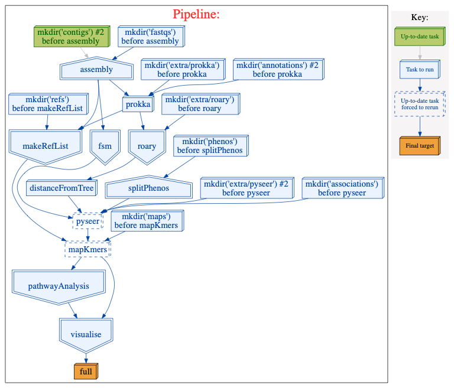

.. header:: 
   ###Page###

.. class:: center

   | **Imperial College London**
   | **Department of Life Sciences**
   | **M.Sc. Bioinformatics and Theoretical Systems Biology**
   |
   |
   |  **BGWAS3**
   |
   |  *Gregory Leeman*

Abstract
========

Acknowledgements
================

Introduction
===========

Genome wide association studies
-------------------------------

Pangenome wide association studies
----------------------------------

Metabolomics
------------

- Describe usfuelness

Methods
=======

CGATcore and Ruffus
-------------------

- What a pipeline does
   
  - 

Tools
-----

Genome Annotation
-----------------

Phylogeny
---------

Associations study
------------------

Kmer mapping
------------

Pathway analysis
----------------

Visulaisation
-------------

Testing
-------

Packaging
---------

Use case
--------

- Describe the data set
- Describe metabolomics

Results
=======

